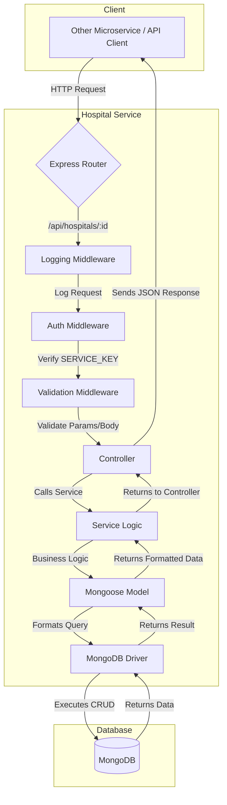

# Hospital Service - Connected Healthcare Ecosystem

<div align="center">
  
  <br/>
  <h1>Hospital Service</h1>
  <p><em>A secure, compliant, and robust microservice for hospital data management within a modern healthcare ecosystem.</em></p>


[](https://nodejs.org/)
[](https://opensource.org/licenses/MIT)
[](http://makeapullrequest.com)
[](./tests)

</div>

---

## 📖 Table of Contents

- [🎯 Overview](#-overview)
- [✨ Features](#-features)
- [🚀 Quick Start](#-quick-start)
- [🐳 Docker Setup](#-docker-setup)
- [🏗️ Architecture & Request Flow](#️-architecture--request-flow)
- [🛣️ API Endpoints](#️-api-endpoints)
- [🛡️ Security & Compliance](#️-security--compliance)
- [🧪 Testing](#-testing)
- [🗂️ Project Structure](#️-project-structure)
- [⚙️ Environment Variables](#️-environment-variables)
- [🤝 Contributing](#-contributing)
- [📄 License](#-license)
- [📞 Support](#-support)

---

## 🎯 Overview

The **Hospital Service** is a core microservice within the **Connected Healthcare Ecosystem**. Its primary responsibility is to manage all hospital-related data, providing a centralized, secure, and reliable source of truth for other services, such as the User Service or Appointment Service.

Built with a modern stack (Node.js, Express, MongoDB), it is designed for scalability, security, and compliance with critical healthcare regulations like the **NDHM (National Digital Health Mission)**, **DPDP Act (Digital Personal Data Protection Act)**, and **Telemedicine Guidelines**. All inter-service communication is authenticated using a shared `SERVICE_KEY` to ensure a secure internal network.

---

## ✨ Features

- **CRUD Operations**: Secure endpoints to create, read, update, and soft-delete hospital records.
- **Data Validation**: Validates `hospitalId` to ensure data integrity when other services (e.g., User Service) link doctors or staff to a hospital.
- **Robust Security**:
  - **Service-to-Service Authentication**: Protects all endpoints with a `SERVICE_KEY`.
  - **Common Vulnerability Protection**: Uses `helmet` to set crucial security headers.
  - **Rate Limiting**: Defends against brute-force attacks (100 requests per 15 minutes).
- **Comprehensive Logging**: Employs `winston` for detailed audit and error logs, crucial for compliance and debugging.
- **Offline-First Capability**: Designed to function with a local MongoDB instance, ensuring development and testing can occur without constant cloud connectivity.
- **Containerized**: Fully containerized with Docker for consistent development, testing, and production environments.

---

## 🚀 Quick Start

### Prerequisites

- Node.js v18+
- MongoDB (local instance or a cloud provider like Atlas)
- Git

### Installation & Setup

1.  **Clone the repository**:
    ```bash
    git clone https://github.com/shoaibkhan188626/hospital_service.git
    cd hospital-service
    ```

2.  **Install dependencies**:
    ```bash
    npm install
    ```

3.  **Set up environment variables**:
    *Create a `.env` file in the root directory by copying the example file.*
    ```bash
    cp .env.example .env
    ```
    *Edit the `.env` file with your specific configurations (database URI, service key, etc.).*
    ```bash
    nano .env
    ```

4.  **Run the server**:
    - For development (with hot-reloading via `nodemon`):
      ```bash
      npm run dev
      ```
    - For production:
      ```bash
      npm start
      ```

5.  **Verify the service is running**:
    *Access the health check endpoint.*
    ```bash
    curl http://localhost:8082/health
    # Expected response: {"status":"UP"}
    ```

---

## 🐳 Docker Setup

Get the service running in a container with just a few commands.

1.  **Build the Docker image**:
    ```bash
    docker build -t hospital-service .
    ```

2.  **Run the container**:
    *This command runs the container and passes the environment variables from your `.env` file.*
    ```bash
    docker run -p 8082:8082 --env-file .env hospital-service
    ```

3.  **Using Docker Compose**:
    *For a more streamlined experience, especially when connecting to a database container.*
    ```bash
    docker-compose up --build
    ```

---

## 🏗️ Architecture & Request Flow

The service follows a standard layered architecture to separate concerns, making it clean, scalable, and easy to maintain.

### Request Lifecycle Flowchart

Here’s a visual representation of how an incoming API request is processed:



> **Flow Explained**:
> 1.  An **HTTP Request** from a client (like the User Service) hits the **Express Router**.
> 2.  The request passes through a chain of **Middlewares**: first for **Logging**, then **Authentication** (validating the `SERVICE_KEY`), and finally for **Input Validation**.
> 3.  If all checks pass, the request reaches the appropriate **Controller**, which orchestrates the response.
> 4.  The **Controller** calls the **Service** layer, which contains the core business logic.
> 5.  The **Service** uses the **Mongoose Model** to interact with the **MongoDB** database.
> 6.  The data flows back through the layers, and the Controller sends the final **JSON Response** to the client.

---

## 🛣️ API Endpoints

All endpoints are prefixed with `/api/hospitals`.

| Method   | Endpoint | Description                | Auth Required    |
| :------- | :------- | :------------------------- | :--------------- |
| `POST`   | `/`      | Create a new hospital.     | ✅ `SERVICE_KEY` |
| `GET`    | `/:id`   | Get a hospital by its ID.  | ✅ `SERVICE_KEY` |
| `PATCH`  | `/:id`   | Update a hospital's details. | ✅ `SERVICE_KEY` |
| `DELETE` | `/:id`   | Soft-delete a hospital.    | ✅ `SERVICE_KEY` |

### Example: Create a Hospital

**Request**: `POST /api/hospitals`

```bash
curl -X POST http://localhost:8082/api/hospitals \
  -H "Authorization: Bearer <YOUR_SERVICE_KEY>" \
  -H "Content-Type: application/json" \
  -d '{
        "name": "City General Hospital",
        "address": "123 Health St, Wellness City",
        "contactNumber": "123-456-7890",
        "location": {
            "type": "Point",
            "coordinates": [-73.987, 40.748]
        }
      }'
```

**Success Response (201 Created)**:

```json
{
    "success": true,
    "data": {
        "_id": "60d5f1f77c3d4a001f8e8b5a",
        "name": "City General Hospital",
        "address": "123 Health St, Wellness City",
        "contactNumber": "123-456-7890",
        "location": {
            "type": "Point",
            "coordinates": [-73.987, 40.748]
        },
        "isActive": true
    },
    "message": "Hospital created successfully"
}
```

---

## 🛡️ Security & Compliance

- **NDHM**: Ensures interoperable data standards and maintains detailed audit logs for all data modifications.
- **DPDP Act**: Implements data minimization principles, uses soft deletes instead of permanent deletion, and ensures all data is securely stored.
- **Telemedicine Guidelines**: Provides a reliable mechanism for validating hospital data, which is essential for verifying doctor and practitioner affiliations.
- **General Security**:
  - **Authentication**: All endpoints are protected and require a valid `SERVICE_KEY` passed as a Bearer Token.
  - **Rate Limiting**: Prevents abuse by limiting requests to 100 per 15 minutes per IP.
  - **Secure Headers**: Uses `helmet` to protect against common web vulnerabilities like XSS and clickjacking.
  - **CORS**: Configured to only allow requests from trusted origins in a production environment.

---

## 🧪 Testing

The project uses **Jest** for unit and integration testing, with **MongoMemoryServer** to create an in-memory database for each test run. This ensures tests are fast, reliable, and don't require a separate database connection.

1.  **Run all tests**:
    ```bash
    npm test
    ```

2.  **Run tests in watch mode**:
    ```bash
    npm run test:watch
    ```

3.  **Test Coverage**:
    *Our goal is to maintain >90% test coverage for all critical business logic.*
    ```bash
    npm run test:coverage
    ```

---

## 🗂️ Project Structure

The project follows a feature-first, layered architectural pattern.

```
hospital-service/
├── config/                 # Configuration (database, logger)
├── controllers/            # API logic (request/response handling)
├── middlewares/            # Request processing middleware (auth, error handling)
├── models/                 # Mongoose schemas and models
├── routes/                 # API route definitions
├── services/               # Core business logic
├── tests/                  # Jest tests (unit, integration)
├── utils/                  # Utility functions (error classes, etc.)
├── .env                    # Environment variables (ignored by git)
├── .gitignore              # Files and folders ignored by git
├── app.js                  # Express application setup and middleware
├── docker-compose.yml      # Docker multi-container configuration
├── Dockerfile              # Instructions for building the Docker image
├── package.json            # Project metadata and dependencies
└── server.js               # Server startup script
```

---

## ⚙️ Environment Variables

These variables must be defined in your `.env` file.

```ini
# Server Configuration
NODE_ENV=development
PORT=8082

# MongoDB Connection
# Use MONGO_URI_LOCAL for local dev, or MONGO_URI_ATLAS for a cloud instance
MONGO_URI_LOCAL=mongodb://localhost:27017/hospital-service
MONGO_URI_ATLAS=mongodb+srv://<user>:<pass>@cluster0.mongodb.net/hospital-service

# Security
JWT_SECRET=your-super-secure-jwt-secret-that-is-at-least-32-characters-long
SERVICE_KEY=a-very-strong-and-secret-key-for-inter-service-communication

# Other Services
NOTIFICATION_SERVICE_URL=http://localhost:8081
```

---

## 🤝 Contributing

Contributions are welcome! Please follow these steps to contribute.

1.  **Fork** the repository.
2.  Create a new feature branch: `git checkout -b feature/my-awesome-feature`
3.  Make your changes and commit them: `git commit -m "feat: Add my awesome feature"`
4.  Run tests to ensure everything is working: `npm test`
5.  Push to your branch: `git push origin feature/my-awesome-feature`
6.  Open a **Pull Request**.

Please adhere to existing code standards (ESLint/Prettier) and ensure new features have corresponding tests.

---

## 📄 License

This project is licensed under the MIT License. See the [LICENSE](LICENSE) file for details.

---

## 📞 Support

- **Project Maintainer**: Shoaib Khan
- **Email**: shoaibullakhan15@gmail.com
- **Issues**: For bugs or feature requests, please [open a GitHub issue](https://github.com/shoaibkhan188626/hospital_service/issues).

---

<div align="center">

**[⬆ Back to Top](#-table-of-contents)**

</div>
